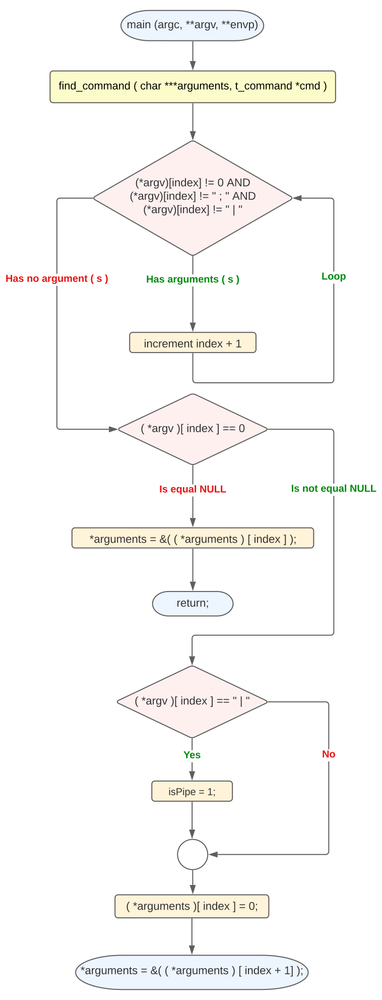
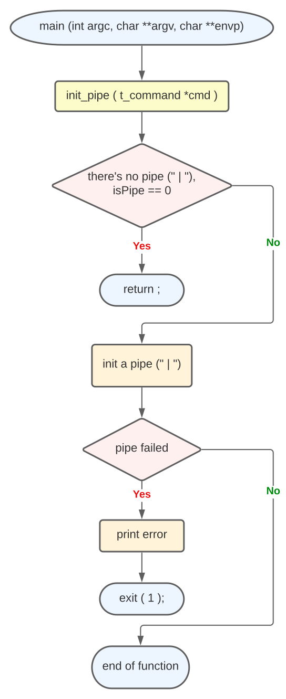
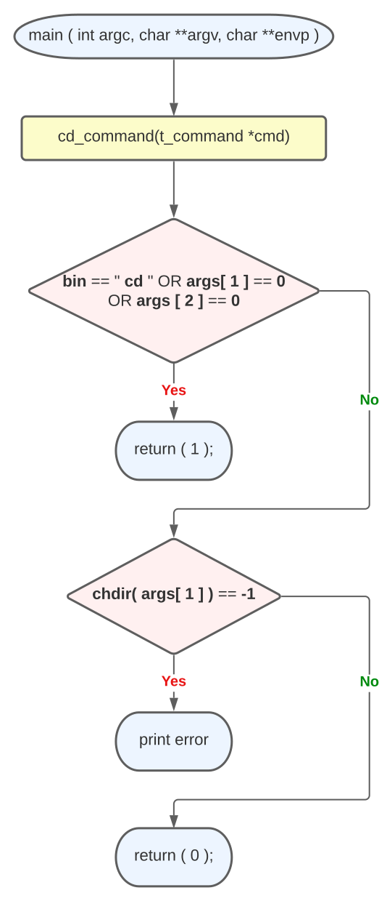
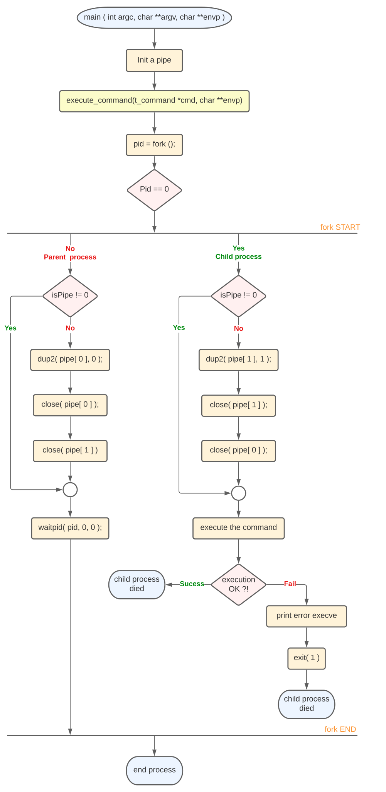

### Table content
1. **[Main](#main)**
2. **[Microshell](#Microshell)**
3. **[Parse command](#Parse_command)**
4. **[Init pipe](#init_pipe)**
5. **[Cd command](#cd_command)**
6. **[Execution](#execution)**

### introduction

* Write a program that will behave like executing a shell command.
* You have to use the absolute path.
* You can only use ; (command separtor) or | (pipe).
  * ````bash
    ./micro /bin/ls ";" /bin/ls -la
    ````

---
### reminder

<details>	
  <summary><b> 🔽 envp </b></summary>

* **char `envp`**: (**env**ironment **p**ointer): 
  * The `envp` parameter is a **pointer to an array of null-terminated strings** that 
  represent the values set in the **user's environment variables**.
  * `$NAME`, `USER=kdi-noce`, `SHELL=/bin/zsh`, etc... .
    <br />
</details>

<details>	
  <summary><b> 🔽 pipe</b></summary>

* **int `pipe`(int pipe_fd[2])**:

    * Parameters :

      * `fd[0]`: `fd` **(file descriptor)** for the
        read end of pipe.
  
      * `fd[1]`: `fd` si for the write end of pipe.
      
      * `Returns` : 0 on Success.
  
      * **-1** on `error`.

    * Conceptually, a **pipe** is a **connection between two processes**.
    * **Pipes** are useful for **communication between related processes**(inter-process communication).
      <br />
</details>

<details>	
  <summary><b> 🔽 chdir</b></summary>

* **int `chdir`(const char *path)**:
  * The `chdir` command is a system function (system call) which is used to **change the current working directory**
    to the directory specified in path.
  * Is **used** as an **alias** for the shell command **cd**.
  * Parameter:
    * The path is the Directory path which the user want to make the current working directory.
  * `Return` Value: 
    * Returns zero **(0)** on success. 
    * **-1** is returned on an `error` and `errno` is set appropriately.
      <br />
</details>

<details>	
  <summary><b> 🔽 fork</b></summary>

* **pid_t `fork`(void)**:
  * `Fork` system call is used for creating a new process, called child process.
  * `Child process` runs concurrently with the process that makes the `fork`() call (`parent process`).
  * A `child process` uses the **same** `pc`(program counter), **same** `CPU` registers, **same open files** which 
  use in the `parent process`.
  * **Negative Value:**
    * creation of a child process was unsuccessful.
  * **Zero:**
    * Returned to the newly created child process.
  * **Positive value:**
    * **Returned to parent or caller**. The value contains process ID of newly created child process.
      <br />
</details>

---
### 0. structure command

````C
typedef struct s_command {
	char	*bin;
	char	**args;
	int		isPipe;
	int		fd[2];
}	t_command;
````
---
### 1. Main function

````C
int	main(int argc, char **argv, char **envp)
{
	if (argc == 1)
    		return 0;
	
	++argv;
	
	return microshell(argv, envp);
}
````

<a name="main"></a>
<details>	
  <summary><b> 🔽 main diagram</b></summary>
  <br />

[](image/main.png)

</details>

----
### 2. Microshell function

````C
static int	microshell(char **args, char **envp)
{
	t_command cmd;

	while (*args)
	{
		cmd.isPipe = 0;
		cmd.bin = *args;
		cmd.args = args;
		find_command(&args, &cmd);
		init_pipe(&cmd);
		if (cd_command(&cmd))
			execute_command(&cmd, envp);

	}
	return (0);
}
````
<a name="Microshell"></a>
<details>	
  <summary><b> 🔽 Microshell diagram</b></summary>
  <br />

[](image/microshell.png)

</details>

---
### 3. Parse command

````C
static void find_command(char ***arg, t_command *cmd)
{
	int i = 0;

	while ((*arg)[i] != 0 && strcmp((*arg)[i], ";") && strcmp((*arg)[i], "|"))
		i++;
	if ((*arg)[i] == 0)
	{
		*arg = &((*arg)[i]);
		return ;
	}
	if (!strcmp((*arg)[i], "|"))
	{
		cmd->isPipe = 1;
	}
	(*arg)[i] = 0;
	*arg = &((*arg)[i + 1]);
}
````
<a name="Parse_command"></a>
<details>	
  <summary><b> 🔽 Parse command diagram</b></summary>
  <br />

[](image/parse_cmd.svg)

</details>

----
### 4. Init pipe

````C
static void init_pipe(t_command *cmd)
{
	if (!(cmd->isPipe))
		return ;
	if (pipe(cmd->fd) == -1)
	{
		print_error("microshell: error: there's no pipe\n");
		exit(1);
	}
}
````
<a name="init_pipe"></a>
<details>	
  <summary><b> 🔽 Init pipe diagram</b></summary>
  <br />

[](image/init_pipe.svg)

</details>

----
### 5. Cd command

````C
static int cd_command(t_command *cmd)
{
	if (strcmp(cmd->bin, "cd") || !(cmd->args[1]) || !(cmd->args[2]))
		return (1);
	if (chdir(cmd->args[1]) == -1)
		print_error("microshell: error: cd\n");
	return (0);
}
````
<a name="cd_command"></a>
<details>	
  <summary><b> 🔽 Cd command diagram</b></summary>
  <br />


[](image/cd_command.svg)

</details>

----
### 6. Execution

````C
static void	execute_command(t_command *cmd, char **envp)
{
	int pid;

	pid = fork();
	if (pid == 0)
	{
		if (cmd->isPipe)
		{
			dup2(cmd->fd[1], 1);
			close(cmd->fd[1]);
			close(cmd->fd[0]);
		}
		if (execve(cmd->bin, cmd->args, envp) == -1)
		{
			print_error("microshell: error: execve");
			exit(1);
		}
	}
	else
	{
		if (cmd->isPipe)
		{
			dup2(cmd->fd[0], 0);
			close(cmd->fd[0]);
			close(cmd->fd[1]);
		}
		waitpid(pid, 0 ,0);
	}
}
````
<a name="cd_command"></a>
<details>	
  <summary><b> 🔽 Execution diagram</b></summary>
  <br />


[](image/execution.svg)

</details>

### Ressources

* thanks to [t-h2o](https://github.com/t-h2o/microshell) for the explanation and his documentation.
